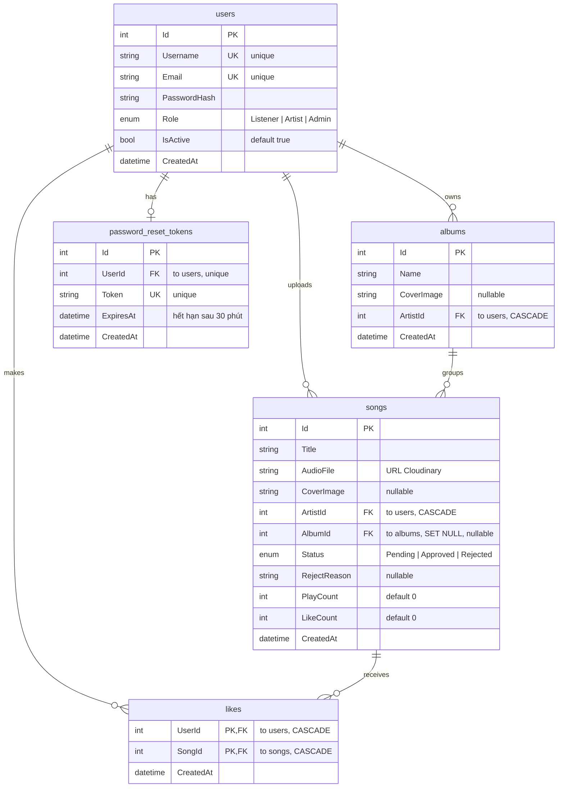

# SoundClown

Ứng dụng nghe nhạc trực tuyến — Blazor Server + PostgreSQL + Cloudinary.

## Công nghệ sử dụng

| Lớp           | Công nghệ                                                |
| ------------- | -------------------------------------------------------- |
| Framework     | ASP.NET Core 8 (Blazor Server, interactive SSR)          |
| Cơ sở dữ liệu | PostgreSQL 16 qua EF Core + Npgsql                       |
| Xác thực      | Cookie-based, BCrypt (cost 12)                           |
| Media         | Cloudinary .NET SDK (upload audio + ảnh bìa)             |
| Email         | MailKit SMTP (luồng reset mật khẩu)                      |
| CSS           | Tailwind CDN + dark theme tự thiết kế (accent `#F5A623`) |
| Audio         | HTML5 `<audio>` qua JS Interop (`wwwroot/js/player.js`)  |

## Yêu cầu

- .NET SDK 8.0
- Docker (để chạy PostgreSQL)
- Tài khoản Cloudinary (free tier — dùng để lưu file audio/ảnh)

## Khởi chạy

### Bước 1 — Tạo file `.env`

Copy file mẫu rồi điền credentials:

```bash
cp .env.example .env
```

Nội dung `.env` tối thiểu cần có (Cloudinary bắt buộc — đăng ký free tại [cloudinary.com](https://cloudinary.com)):

```
DB_CONNECTION_STRING=Host=localhost;Database=soundclown;Username=postgres;Password=postgres
AUTH_COOKIE_NAME=music_auth
AUTH_EXPIRE_DAYS=7

CLOUDINARY_CLOUD_NAME=<điền từ Cloudinary dashboard>
CLOUDINARY_API_KEY=<điền từ Cloudinary dashboard>
CLOUDINARY_API_SECRET=<điền từ Cloudinary dashboard>

# Mail (tuỳ chọn — chỉ cần cho luồng reset mật khẩu)
MAIL_HOST=smtp.gmail.com
MAIL_PORT=587
MAIL_USERNAME=your_email@gmail.com
MAIL_PASSWORD=your_app_password

APP_BASE_URL=http://localhost:5000
```

### Bước 2 — Khởi động PostgreSQL

```bash
docker compose up -d
```

Container `soundclown-db` chạy ở port 5432.

### Bước 3 — Chạy ứng dụng

```bash
dotnet run --urls "http://localhost:5000"
```

Lần chạy đầu, app tự tạo schema + seed dữ liệu (3 tài khoản mặc định + 1000 bài hát giả).

### Bước 4 — Truy cập

Mở trình duyệt: **http://localhost:5000**

## Tài khoản mặc định (seed sẵn)

| Vai trò  | Email               | Mật khẩu       |
| -------- | ------------------- | -------------- |
| Admin    | `admin@music.com`   | `Admin123456!` |
| Listener | `listener@demo.com` | `Listener123!` |
| Artist   | `artist@demo.com`   | `Artist123!`   |

## Tính năng chính

- **3 vai trò**: Listener (nghe + tương tác), Artist (upload + quản lý tác phẩm), Admin (duyệt nội dung).
- **Vòng đời bài hát**: Artist upload → `Pending` → Admin duyệt → `Approved` (công khai) / `Rejected` (kèm lý do). Artist sửa bài → status reset về `Pending`.
- **Phát nhạc**: HTML5 `<audio>` qua JS Interop, queue chuyển bài tự động, đếm lượt nghe sau 30 giây.
- **Tương tác**: Like/Unlike, chia sẻ link bài hát, tìm kiếm có debounce 300ms.
- **Artist Dashboard**: Upload audio MP3 ≤10MB + ảnh bìa ≤2MB, quản lý album, xem thống kê lượt nghe/like.
- **Admin Panel**: Duyệt/từ chối bài Pending, khóa/mở khóa user.

## Cấu trúc thư mục (rút gọn)

```
soundclown-mvp/
├── Program.cs                  # DI, middleware, cấu hình auth
├── Components/                 # Blazor UI (Layout, Admin, Artist, Auth, Main, Shared)
├── Controllers/                # MVC fallback cho auth + API endpoint cho test
├── Data/                       # AppDbContext + Seeders
├── DTOs/ Entities/ Enums/      # Domain layer
├── Services/                   # Business logic (tất cả Scoped)
├── wwwroot/                    # CSS, JS, ảnh tĩnh
├── docs/                       # Báo cáo + diagrams + scripts hỗ trợ
└── tests/                      # 41 testcase (xem tests/README.md)
```

## Cơ sở dữ liệu (ERD)

5 bảng do EF Core sinh từ các entity trong `Entities/`. Quan hệ và ràng buộc cấu hình tại `Data/AppDbContext.cs`.



**Ràng buộc chính:**

- `users.Username`, `users.Email` — UNIQUE.
- `songs.ArtistId`, `albums.ArtistId` → `users.Id` với **CASCADE DELETE** (xóa user → xóa toàn bộ bài hát + album của họ).
- `songs.AlbumId` → `albums.Id` với **SET NULL** (xóa album → bài hát trở thành single, không bị xóa).
- `likes` — khóa chính ghép `(UserId, SongId)`, đảm bảo mỗi user chỉ like một bài 1 lần; CASCADE DELETE từ cả `users` và `songs`.
- `password_reset_tokens.UserId` — UNIQUE (mỗi user tối đa 1 token reset đang hiệu lực); `Token` — UNIQUE.
- Index phụ trên `songs.Status` và `songs.ArtistId` để tối ưu truy vấn lọc bài đã duyệt / bài của artist.

## Reset cơ sở dữ liệu

```bash
docker exec -it soundclown-db psql -U postgres -c "DROP DATABASE soundclown;"
dotnet run --urls "http://localhost:5000"   # app tự tạo lại schema khi khởi động
```

## Kiểm thử

Đề tài có **41 testcase**: 20 manual + 16 unit test (xUnit) + 5 E2E (Playwright).

Hướng dẫn chạy test đầy đủ → [tests/README.md](tests/README.md).

Chạy nhanh test tự động:

```bash
dotnet test tests/SoundClown.UnitTests                       # unit (không cần app chạy)
docker compose up -d && dotnet run --urls "http://localhost:5000" &
dotnet test tests/SoundClown.E2ETests                        # E2E (cần app + DB chạy)
```
