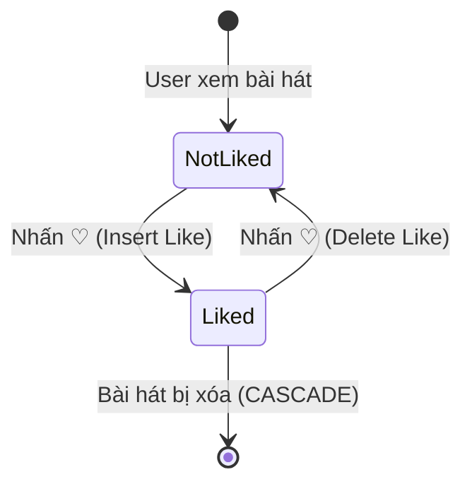

# Like Toggle — State Diagram

## Mô tả

| Trạng thái | DB | UI |
|------------|-----|-----|
| NotLiked | Không có bản ghi Like (UserId, SongId) | Icon ♡ trắng/xám, LikeCount hiện tại |
| Liked | Tồn tại bản ghi Like (UserId, SongId) | Icon ♡ đỏ, LikeCount + 1 |

## Quy tắc

- Toggle idempotent: nhấn lại sẽ chuyển sang trạng thái ngược
- LikeCount không âm: `Math.Max(0, LikeCount - 1)` khi unlike
- 5 lần nhấn liên tiếp -> kết quả cuối cùng là Liked (toggle: like -> unlike -> like -> unlike -> like)
