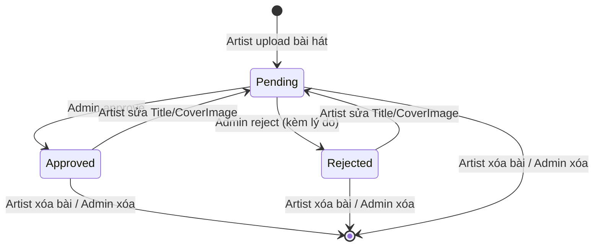

# Song Lifecycle — State Diagram

## Mô tả chuyển trạng thái

| Chuyển | Trigger | Điều kiện | UC liên kết |
|--------|---------|-----------|-------------|
| [new] -> Pending | Artist upload bài hát | File audio hợp lệ, size <= 10MB | UC-01 |
| Pending -> Approved | Admin nhấn Duyệt | Role = Admin | UC-04 |
| Pending -> Rejected | Admin nhấn Từ chối | Role = Admin, lý do không trống | UC-04 |
| Approved -> Pending | Artist sửa Title hoặc CoverImage | ArtistId == userId | UC-08 |
| Rejected -> Pending | Artist sửa Title hoặc CoverImage | ArtistId == userId | UC-08 |
| [any] -> [deleted] | Artist xóa bài hát | ArtistId == userId | UC-08 |

## Lưu ý

- Chỉ thay đổi AlbumId KHÔNG trigger reset Status
- Bài Approved công khai trên trang chủ và tìm kiếm
- Bài Pending/Rejected chỉ hiển thị cho chủ bài và Admin
